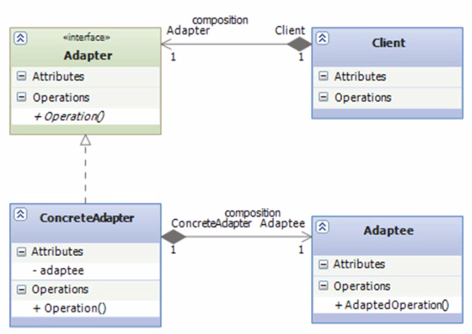

# Adapter

## Мотивация

- Класс, который может быть полезен для вашего приложения не соответствует ожидаемому интерфейсу
- Вы разрабатываете класс или фреймворк и хотите быть уверены в том, что он будет полезен для широкого круга еще ненаписанных классов и приложений
- Адаптеры так же известны как Обертки (Wrappers)

## Назначение

- Преобразовать интерфейс класса к интерфейсу, необходимому клиенту
- Позволить классам работать совместно, что было бы невозможно, имей они несовместимые интерфейсы
- Защитная техника. Клиенты зависят от предоставленного им интерфейса адаптера, а не от конкретных классов непосредственно

## Применимость

Паттерн Adapter применяется в случае, если:

- Вы хотите использовать существующий класс, но его интерфейс не соответствует тому, что вы ожидаете
- Вы хотите создать класс который мог бы взаимодействовать с непредусмотренными классами (классами которые не обязаны иметь совместимый интерфейс)

## Структура

## Использование

- Клиент зависит от интерфейса адаптера, а не от конкретной реализации
- Создается по крайней мере один конкретный класс Adapter, позволяющий клиенту использовать реализацию необходимого ему конкретного класса
- Будующие клиенты, которым потребуется альтернативная реализация, смогут использовать дополнительный конкретный класс Adapter
- Эффективный способ соблюдения принципа Открытости/Закрытости

## Взаимодействие между компонентами

- Клиенты вызывают методы экземпляра Adapter
- Экземпляр Adapter вызывает методы Adaptee для выполнения реальной работы
