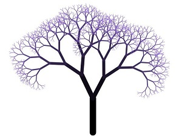
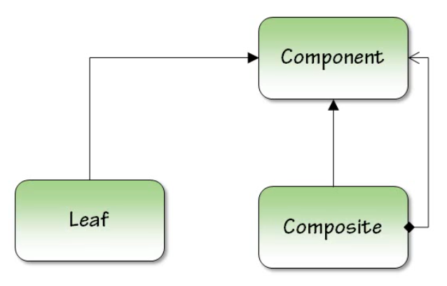

# Composite (Компоновщик)

**Структурный шаблон проектирования, объединяющий объекты в древовидную структуру для представления иерархии от частного к целому. Компоновщик позволяет клиентам обращаться к отдельным объектам и к группам объектов одинаково.**

## Цель

Паттерн определяет иерархию классов, которые одновременно могут состоять из примитивных и сложных объектов, упрощает архитектуру клиента, делает процесс добавления новых видов объекта более простым.

## Структура

